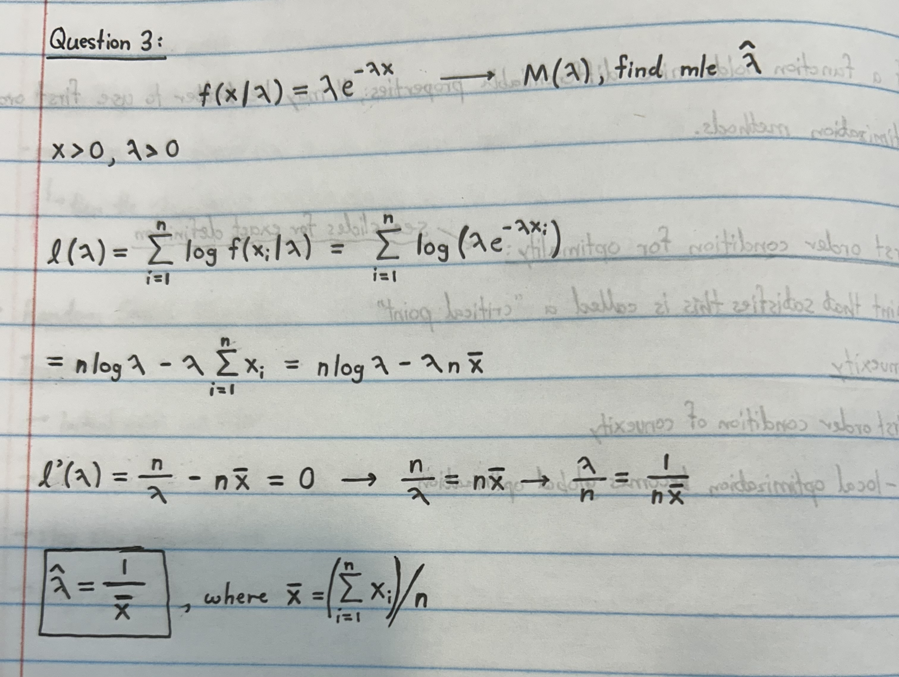

```{r setup, include=FALSE}
knitr::opts_chunk$set(echo = TRUE)
```

```{r, include=FALSE}
#including necessary libraries
library(tidyverse)
library(ggplot2)
```

# Question 1:

## a.)

$$c(g, E) = g + E, 0 \le g \le 8, 0 \le E \le 4$$

## b.)

$$c(r, t) = t - 10r, 0 \le r \le 5, 0 \le t \le \infty$$

## c.)

Let g represent gym badges and r represent ribbons $$c(g, r) = g + 2r$$ Constraints... $$g + r \le 12, 0 \le r \le 5, 0 \le g \le 8$$

## d.)

As I walk to stats 102b, I want to minimize the distance to get from my dorm to class, however I would also like my walk to be as flat as possible. Let E be my elevation gain in meters, and let D be my horizontal distance traveled in meters. 15 less meters of horizontal distance gives me the same satisfaction of 1 less meter of vertical distance. $$c(E, D) = -15E - D, E \ge 0, D \ge 0$$

# Question 2:

```{r}
aem <- function(g, n, N, LB = -1, UB = 1, method = "deterministic", min = TRUE) {
  # start timer:
  start_time <- Sys.time()
  
  # validate inputs
  if (n < 1) {
    stop("n must be an integer greater than or equal to 1")
  }
  
  # if inputs are valid, create initial list object
  result <- list(index = c(), val = c(), eval_matrix = c(), time = c())
  
  if (method == "deterministic") {
    # create a set of sampling points distributed evenly in a grid-like fashion
    points_vector <- seq(LB, UB, length = N)
    # get all combinations of those points for n dimensions
    sample_points <- expand.grid(replicate(n, points_vector, simplify = FALSE))
    if (n == 1) {
      sample_points <- seq(LB, UB, length = N)
    }
  }
  
  if (method == "stochastic") {
    # create a set of sampling points randomly uniformly distributed
    vectors <- lapply(1:n, function(i) runif(N, min = LB, max = UB))
    sample_points <- expand.grid(vectors)
    if (n == 1) {
      sample_points <- runif(N, min = LB, max = UB)
    }
  }
  
  
  # evaluate all combinations of those sample points:
  if (n > 1) {
    evaluated_points <- apply(sample_points, 1, function(vec) f(vec))
  }
  if (n == 1) {
    evaluated_points <- sapply(sample_points, g)
  }
  
  # create an eval_matrix:
  eval_matrix <- as.matrix(cbind(sample_points, evaluated_points))
  
  # minimize the function
  if (min == TRUE) {
    minimum <- min(evaluated_points)
    # add "val" to the result
    result$val <- minimum
    # find arg min:
    if (n > 1) {
      argmin <- as.vector(sample_points[which(evaluated_points == minimum), ])
    # add arg min to result:
    result$index <- argmin[1, ]
    }
    if (n == 1) {
      argmin <- as.vector(sample_points[which(evaluated_points == minimum)])
      result$index <- argmin[1]
    }
  }
  # maximize the function
  if (min == FALSE) {
    maximum <- max(evaluated_points)
    # add "val to the result
    result$val <- maximum
    # find arg max:
    if (n > 1) {
      argmax <- as.vector(sample_points[which(evaluated_points == maximum), ])
      # add arg max to result:
      result$index <- argmax[1, ]
    }
    if (n == 1) {
      argmax <- as.vector(sample_points[which(evaluated_points == maximum)])
      result$index <- argmax[1]
    }
  }
  
  # end timer:
  end_time <- Sys.time()
  time_elapsed <- end_time - start_time
  # add time to result
  result$time <- as.numeric(time_elapsed)
  # add eval matrix to result
  result$eval_matrix <- eval_matrix
  
  # return the result
  result
}
```

Below, I will test my **aem** function using the code provided in the homework instructions...

```{r}
# testing my aem function...
f <- function(v) {
  v[1]^2 + v[2]^2
}

# test 1:
test_1 <- aem(f, n = 2, N = 100)
test_1$index
test_1$val

set.seed(24601)

# test 2:
test_2 <- aem(f, n = 2, N = 100, method = "stochastic")
test_2$index
test_2$val
```

```{r}
h <- function(v) {
  exp(abs(v[1]^2 - 1) + abs(v[2]^3 + abs(v[3])))
}

# test 1:
test_1 <- aem(h, n = 3, N = 100, LB = -2, UB = 2)
test_1$index
test_1$val

set.seed(24601)
#test 2:
test_2 <- aem(h, n = 3, N = 100, LB = -2, UB = 2, method = "stochastic")
test_2$index
test_2$val
```

```{r}
j <- function(v) {
  log(abs(sin(v[1]) + cos(v[2])) + 1)
}
set.seed(24601)

# test 1:
test_1 <- aem(j, n = 2, N = 100, method = "stochastic")
test_1$index
test_1$val

# test 2:
test_2 <- aem(j, n = 2, N = 100, method = "stochastic", min = FALSE)
test_2$index
test_2$val
```

# Question 3:

## a.)

- Calculation for MLE...


## b.)

```{r}
obs <- c(0.368, 0.714, 0.126, 0.006, 0.525, 0.36, 0.095, 0.212, 0.107, 0.058)
x_bar <- mean(obs)
MLE <- 1 / x_bar
MLE
```

## c.)
```{r}
set.seed(1234)

obs <- c(0.368, 0.714, 0.126, 0.006, 0.525, 0.36, 0.095, 0.212, 0.107, 0.058)
x_bar <- mean(obs)
n <- length(obs)

g <- function(lambda) {
   n * log(lambda) - lambda * n * x_bar
}

result <- aem(g, n = 1, N = 1000, LB = 0, UB = 5, method = "stochastic", min = FALSE)
result$index
```

- This result is comparable with the true maximum likelihood value, as it is approximately within 0.001 of the true value.   

# Question 4:

```{r}
k <- function(v) {
  sum(v^2)
}

times <- c()
dim <- c(1:4)
for (n in 1:4) {
  result <- aem(k, n, N = 30, LB = -1, UB = 1, method = "stochastic")
  time <- result$time
  times <- append(times, time)
}
times_table <- data.frame(time = times,
                          dimension = dim)
ggplot(data = times_table, aes(x = dimension, y = time)) + 
  geom_point(color = "blue") + geom_line(color = "red") + 
  ylab("time (seconds)")
```

-   We see from the graph that increasing dimension drastically increases the time it takes for the algorithm to run.

# Question 5:

## a.)

-   The **random search algorithm** considers a random set of directions from a point and then chooses the direction with greatest descent. In one dimension, there are only two possible directions to go in.
-   The **coordinate search algorithm** considers all directional vectors from a point with one dimension being non-zero and all other dimensions being zero. Then, it will choose the direction with greatest descent. Once again, in one dimension, the two candidate options will be the same as random search.
-   The **coordinate descent algorithm** evaluates one direction AND its negative and steps in a direction if it produces descent. It can be more computationally efficient than the coordinate search algorithm, however in one dimension, the candidate directions for stepping are the exact same as random search and coordinate search.

## b.)

```{r}
# attempts to minimize any one variable function
zom <- function(g, alpha, w0, K) {
  # create empty result list:
  result <- list(index = c(), val = c())
  
  # define variables
  curr_iter <- 0
  curr_point <- w0
  while (curr_iter < K) {
    # current point's evaluation:
    curr_eval <- g(curr_point)
    # points to evaluate the function g at:
    sample_points <- c(curr_point + alpha, curr_point - alpha)
    # points evaluated
    evaluated_points <- sapply(sample_points, g)
    # find the difference between the old and new evaluation:
    diff_1 <- evaluated_points[1] - curr_eval
    diff_2 <- evaluated_points[2] - curr_eval
    
    # pick the best new point:
    if (diff_1 <= diff_2) {
      curr_point <- sample_points[1]
    } else {
      curr_point <- sample_points[2]
    }
    
    # increment curr_iter:
    curr_iter <- curr_iter + 1
  }
  
  # set the "index" to be the current point:
  result$index <- curr_point
  # set the "val" to be the function evaluated at the current point:
  result$val <- g(curr_point)
  # output the result
  result
}
```

## c.)

I will now test my "zom" function...
```{r}
f <- function(w) {
  (sin(3*w)) + (0.3*(w^2))
}

zom(f, alpha = 0.1, w0 = 4.5, K = 10)

zom(f, alpha = 0.1, w0 = -1.5, K = 10)
```

- The function outputs from above match with the exercise shown in slides 50 and 51. When w0 = 4.5, the algorithm converged to a local minimum, but when w0 = -1.5, the algorithm converged to the global minimum. 

## d.)

- Maximizing the log likelihood is the same as minimizing the negative of the log likelihood function...
```{r}
obs <- c(0.368, 0.714, 0.126, 0.006, 0.525, 0.36, 0.095, 0.212, 0.107, 0.058)
x_bar <- mean(obs)
n <- length(obs)

g <- function(lambda) {
   -(n * log(lambda) - lambda * n * x_bar)
}

result <- zom(g, alpha = 0.01, w0 = 1, K = 1000)
result$index
```


## e.)
```{r}
# parameter values
alpha_values <- c(1, 0.1, 0.01, 0.001)
K_values <- c(10, 100, 1000, 10000)

# Generate all combinations of parameter values
parameter_combinations <- expand.grid(alpha = alpha_values, K = K_values, w0 = 1)

# Replicate each value of K the appropriate number of times
K_values_rep <- rep(K_values, each = length(alpha_values))

# Apply your function to each combination of parameters
results <- mapply(zom, g = list(g), alpha = parameter_combinations$alpha, 
                  w0 = parameter_combinations$w0, K = K_values_rep, SIMPLIFY = FALSE)

# Create a data frame to store the results
results_df <- data.frame(
  alpha = parameter_combinations$alpha,
  K = K_values_rep,
  index = sapply(results, function(x) x$index),
  val = sapply(results, function(x) x$val)
)

# Print the results data frame
print(results_df)
```

- We see that when alpha is low and K is large, we are more likely to get accurate results, however it is more computationally expensive. A small alpha with a small K could result in very small steps and non-convergence by the time the iterations are complete. A large alpha would result in large oscillations and could be bad for convergence, regardless of the K value. 


